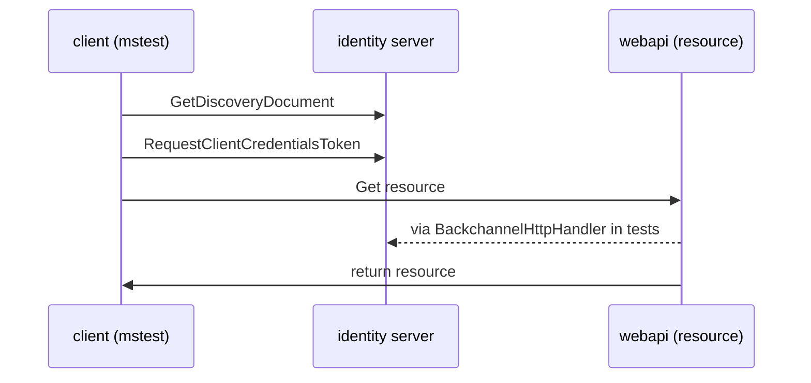

# Scratch

## 2. QS1: Protecting an API using Client Credentials

https://docs.duendesoftware.com/identityserver/v6/quickstarts/1_client_credentials/

This was HARD!

The important test is `Given_IdentityClient_When_CallApi_ThenSuccess`

### Setup projects

- this was `dotnet new blah blah...`
- I used external aliases to make the different apis able to use 'Program' as their startup class.

### Troubleshooting

1. Could not find the correct url for the testservers
   - fix by setting `BaseAddress` when create client with factory
   - IGNORE host server features - that solved it the really hard way when hosting the actual host, but I can't find how to do that in the newer version of dotnet
2. Could not connect to identityserver with api with identityserver
   - Fix by using BackchannelHttpHandler in api to call idsvr
   - https://stackoverflow.com/questions/39390339/integration-testing-with-in-memory-identityserver
   - this was the tough bit!
   - I'm still not sure how to do this generically.
   - IGNORE: sharing httpclient between testservers... I couldnt get that to work. May try again later for generic solution.

## 1. Init

Setup repo

- Add the `.devcontainer\devcontainer.json` with C# Images, features, extensions etc
  - and `post-create.sh` - it currently has commented out how to download
    different dotnet versions
- Add `.vscode\settings.json`
  - I just want that 80 char ruler!
